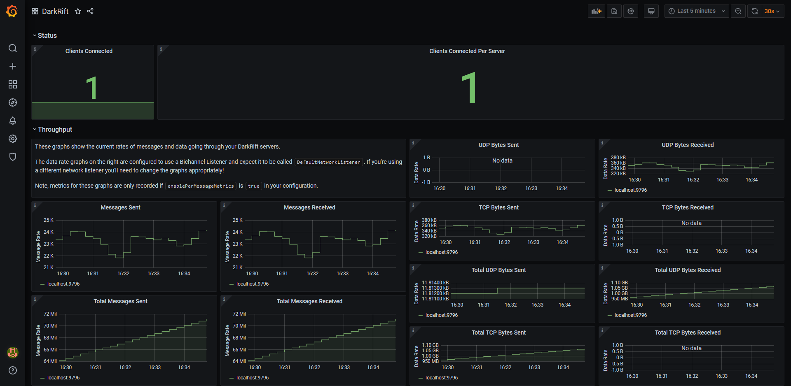
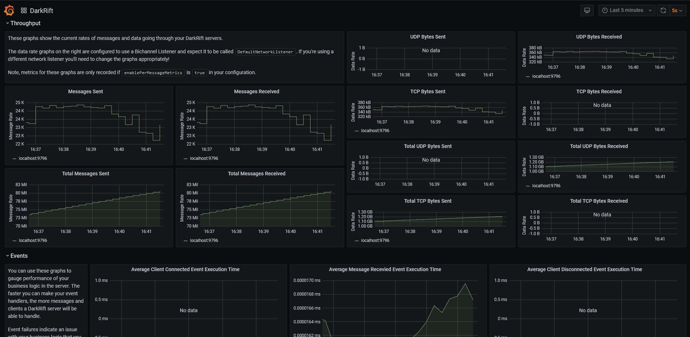

# Grafana Dashboards for DarkRift
This repo contains [Grafana](https://grafana.com/) dashboards designed to help you get monitor your [DarkRift](https://darkriftnetworking.com) servers.



## Setup
**You will need DarkRift Pro in order to view metrics.**

1. Install [Prometheus](https://prometheus.io/download/)
2. Install [Grafana](https://grafana.com/grafana/download)
3. Add the following configuration to your DarkRift server's `Server.config` file
    ```xml
    <metrics enablePerMessageMetrics="true">
      <metricsWriter type="PrometheusEndpoint" />
    </metrics>
    ```
    `enablePerMessageMetrics` will slow down your server if you are running it under high load but will allow the dashboard to show additional metrics. Consider carefully whether you want that enabled.
4. Add the following configuration to your Prometheus server's `prometheus.yml` file underneath `scrape_configs`
    ```yml
      - job_name: 'darkrift'
        static_configs:
        - targets: ['localhost:9796']
    ```
5. Start your DarkRift server and your Prometheus server. To check the configuration so far navigate to [http://localhost:9090](http://localhost:9090) and search for metrics beginning with `darkrift`.
6. Start Grafana, login with username `admin` and password `admin`.
7. Configure a new data source in Grafana by going to `Configuration` (on the left bar) -> `Data Sources` -> `Add Data Source` -> `Prometheus`. Set the URL to be `http://localhost:9090` and leave the name as `Prometheus`.
8. Copy the JSON in [darkrift.json](./darkrift.json) and in Grafana go to `Create` (on the left bar) -> `Import`. Paste your JSON there and click `Load`.

